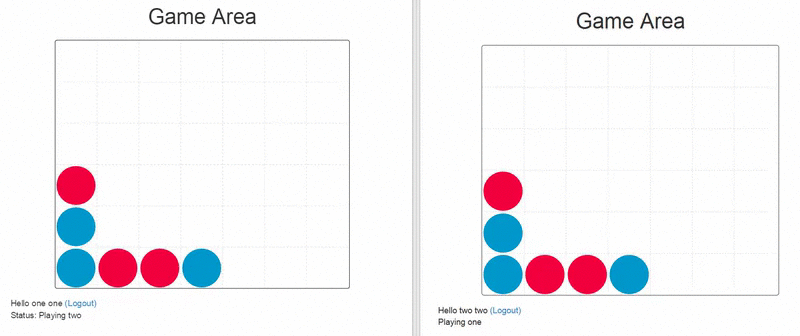
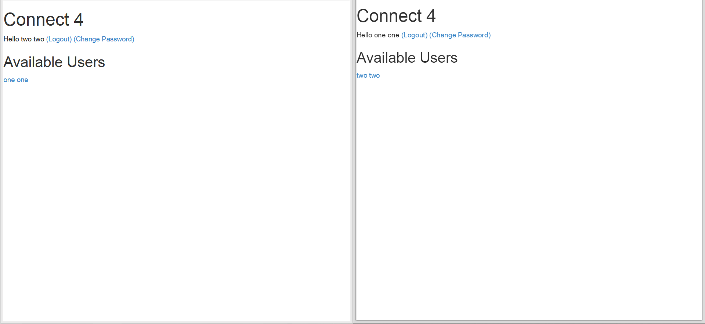
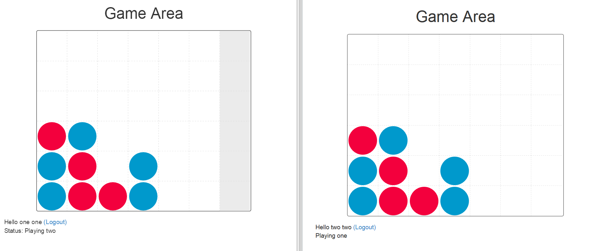

# Connect4
Web-based implementation of classic 70s game of Connect 4

Built with:
* PHP
* MySQL

### Features
* Multi-player
* Online chat <i>(disabled in demo)</i>
* Real-time in-game notification
* User login/signup
* Captcha

### How to play
When you login, you will see a list of available players

Click on the player to challenge him/her and start playing.   Challenger goes first.

Player that connects four discs of the same color next to each other vertically, horizontally, or diagonally wins!
